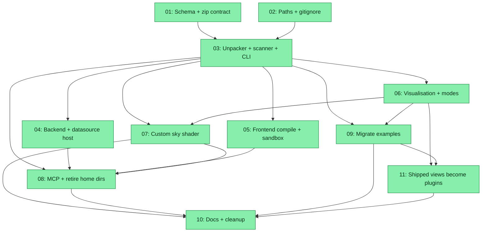

# Spec: Unified Plugin Zips

## Status
Completed

## Overview

Today zoto-viz ships **two** parallel plugin systems that overlap almost
entirely:

- `service/plugins.py` — loose YAML views under `~/.zoto-viz/plugins/`,
  gated by `schema/view-plugin.schema.json`.
- `service/agent_plugins.py` — zip bundles under
  `~/.zoto-viz/agent-plugins/`, gated by `schema/agent-plugin.schema.json`,
  installable via MCP `install_plugin_zip`, and **mirrored** into the
  view-plugin store so the frontend sees them.

This spec replaces **both** with a single zip-based plugin format,
committed into a repo-root `plugins/` directory. Every plugin is a
`<id>.zip` whose one required member is `plugin.yml` (metadata + capability
declarations). Optional folders declare optional parts of the plugin
(convention-over-config):

```
<id>.zip
  plugin.yml                 # required
  visualisation.yml          # optional (engine/base/look/layout/…)
  frontend/                  # optional TypeScript module (+ tests)
  sky/sky.yml                # optional sky recipe / pins
  sky/fragment.glsl          # optional custom far-field shader (GLSL)
  datasource/streams.yml     # optional consumes/produces + field mapping
  datasource/collector.py    # optional trusted collector
  backend/service.py         # optional on_snapshot/setup/teardown hooks
```

Editable source lives at `plugins/src/<id>/` (same layout, unpacked); the
CLI `plugin pack` produces the committed `plugins/<id>.zip`. At runtime,
zips are extracted into a gitignored `plugins/.runtime/<id>/` cache whenever
the zip sha256 changes. `~/.zoto-viz/plugins/` and `~/.zoto-viz/agent-plugins/`
are retired — plugins ship with the repo, and dropping a zip into
`plugins/` (or `plugin add <zip>` / MCP `install_plugin_zip`) copies it into
the same catalog. The live view menu **is** that catalog: host TypeScript
keeps graph bases and arcade engines as wrap targets, and every former
shipped view (`topology`, `talkers`, …, `doom`) is a default `plugins/<id>.zip`.

Only `plugin.yml` is required so that look-only or engine-only overlays do
not need empty stubs. Anything else is optional. This spec explicitly does
**not** introduce `skills/` or generate-UI in v1.

### User-data migration

Users already have plugins installed under `~/.zoto-viz/plugins/` (view
YAMLs and view-plugin directories) and `~/.zoto-viz/agent-plugins/<id>/`
(zip-installed agent plugins). The new build must not silently orphan
them. On first startup after upgrade:

1. Scan `~/.zoto-viz/agent-plugins/*/manifest.json` and
   `~/.zoto-viz/plugins/*.yml` (+ `~/.zoto-viz/plugins/*/plugin.yml`).
2. For each id not already present in `plugins/*.zip` or
   `plugins/src/<id>/`, copy the directory into `plugins/src/<id>/`
   (translating the old agent-plugin layout — see subtask 09) and print a
   loud console line: `[plugin-migrate] <id> copied to plugins/src/<id>/
   — run 'zoto-viz.py plugin pack <id>' to commit`.
3. Do **not** auto-pack, do **not** auto-commit — the operator runs
   `plugin pack` and `git add` themselves.
4. Legacy trees remain in place so a rollback (see below) still finds
   them. Subtask 08 owns the migration code; the DoD lists it.

### Rollback window

Subtask 08 keeps `service/agent_plugins.py` and the two legacy schemas
behind a `ZOTO_VIZ_LEGACY_PLUGINS=1` opt-in for one release: when the env
var is set, the old scanner + MCP tool run in parallel with the new
catalog and the legacy home dirs are re-seeded. Subtask 10 removes the
flag and the file entirely only after this spec has ridden a release
green in CI (tracked as a follow-up spec).

### MCP write safety

`install_plugin_zip` now writes into a git-tracked directory
(`plugins/*.zip`), so it needs the following guards spec'd in subtask 08:

1. Loopback-MCP only — the existing `service/mcp.py` host check must
   stay; hosted MCP is not on the roadmap.
2. Refuse to overwrite unless the caller passes `overwrite: true` **and**
   `plugins/<id>.zip` differs by sha256 (mirrors the CLI `--force`
   contract from subtask 03).
3. Refuse to write when the working tree is dirty (uncommitted changes
   to `plugins/*.zip` or `plugins/src/<id>/`) unless `--force` is passed.
4. Never `git add` or `git commit` — return the written path in the
   response and let the operator promote.
5. Document the guards in `docs/plugins.md` and `docs/agent.md`
   (subtask 10).

## Key Decisions

- **Single format, single schema.** `schema/plugin.schema.json` replaces
  both `schema/view-plugin.schema.json` and `schema/agent-plugin.schema.json`.
- **Committed catalog.** Plugins live in the repo (`plugins/*.zip`) rather
  than in a home directory. `~/.zoto-viz/plugin-consent.yml` remains the
  per-user consent store.
- **Convention-over-config.** Folder/file presence is the switch — no
  registry inside `plugin.yml` for optional parts.
- **Unpack cache.** `plugins/.runtime/<id>/` is gitignored; re-extract when
  the zip sha256 changes.
- **Editable source.** `plugins/src/<id>/` holds the unpacked, human-edited
  version; `plugin pack` writes the zip.
- **Zip safety** (from `agent_plugins.py`) applies to every plugin: 1.5 MB
  compressed, 4 MB uncompressed, ≤ 80 files, reject `..`, restrict member
  suffixes (`.yml`, `.yaml`, `.json`, `.py`, `.ts`, `.tsx`, `.js`, `.mjs`,
  `.css`, `.html`, `.md`, `.txt`, `.svg`, `.png`, `.jpg`, `.jpeg`, `.webp`,
  `.gif`, `.glsl`).
- **Consent, unified.** The existing consent stamp (per-plugin
  `~/.zoto-viz/plugin-consent.yml`) covers TypeScript **and** GLSL custom
  shaders **and** Python (`backend/service.py` + `datasource/collector.py`).
  Stamp payload includes the sha256 of every sensitive artefact so any edit
  invalidates prior approval.
- **Python execution.** In-process hot-load stays behind the existing
  `ZOTO_VIZ_PLUGIN_SERVICE` env gate + consent. Datasource collectors follow
  the same rule.
- **Custom sky shader** compiles into the existing WebGL2 pipeline in
  `web/src/graph/backdrop.ts` — coexists with the shipped sky enum and AI
  Dynamic. Served like `module.js`, with source-review consent.
- **Every view is a plugin.** The live view menu is the plugin catalog.
  Host TypeScript keeps graph bases and arcade engines as wrap targets;
  it does not ship a hardcoded `MODES` menu. Former shipped views
  (`topology`, `talkers`, `services`, `protocols`, `layers`, `watch`,
  `netpong`, `invaders`, `command`, `frogger`, `cores`, `load`,
  `cpupong`, `doom`) are default catalog zips. Duplicate plugin ids
  overlay look on the first catalog row (plugin-on-plugin), not on a
  built-in mode.
- **MCP alignment.** `install_plugin_zip` now writes into `plugins/*.zip`
  (repo catalog) instead of `~/.zoto-viz/agent-plugins/`. No more mirroring.
- **WIP awareness.** Current in-flight work (doom arcade engine, sky-ai,
  dirty `service/plugins.py`, docs) must continue to build after this
  refactor; several subtasks call out coexistence explicitly.
- **Rollback window.** `service/agent_plugins.py` + the two legacy
  schemas survive one release behind `ZOTO_VIZ_LEGACY_PLUGINS=1`; a
  follow-up spec deletes them. See the User-data migration + Rollback
  sections above.
- **MCP writes never auto-commit.** `install_plugin_zip` writes into a
  git-tracked directory (loopback-only, dirty-tree guarded, no
  auto-`git add`) — see the MCP write safety section above.

## Requirements

1. One plugin format, one schema (`schema/plugin.schema.json`).
2. Committed `plugins/*.zip` + editable `plugins/src/<id>/`. Runtime unpack
   into gitignored `plugins/.runtime/<id>/`.
3. Only `plugin.yml` required; every other part is optional.
4. CLI: `zoto-viz.py plugin validate|list|pack|add`.
5. MCP `install_plugin_zip` writes into `plugins/*.zip` and unpacks; no
   mirroring into a view-plugin dir.
6. Retire `~/.zoto-viz/plugins/` and `~/.zoto-viz/agent-plugins/` on-disk
   seeding/mirroring. Consent file (`~/.zoto-viz/plugin-consent.yml`) stays.
7. Plugin `backend/service.py` keeps setup/teardown/on_snapshot semantics
   from `service/hooks.py` (no capture-ring injection). Behind consent +
   `ZOTO_VIZ_PLUGIN_SERVICE`.
8. Optional `datasource/streams.yml` maps existing monitor streams to
   frontend consumers. Optional `datasource/collector.py` allowed under
   consent + `ZOTO_VIZ_PLUGIN_SERVICE`.
9. Optional `frontend/` module compiles with esbuild (as today) and loads
   in the iframe sandbox with the capability allowlist unchanged.
10. Optional `sky/fragment.glsl` becomes an extra branch in the
    `backdrop.ts` pipeline, activated when a plugin view is selected.
11. Optional `visualisation.yml` populates a `PluginView` (engine/base/
    look/style/layout/options/config). The view menu is catalog-only.
    Duplicate plugin ids overlay look on the first catalog row.
12. Existing examples (`examples/plugins/*.yml`, `examples/agent-plugins/lan-pulse/`,
    and the WIP `examples/plugins/doom.yml`) migrate into
    `plugins/src/<id>/` + packed `plugins/<id>.zip`. Old example trees are
    retired. Those migrated zips **are** the views (not overlays of
    built-in modes).
13. Strip hardcoded `MODES` from the live menu (`web/src/core/modes.ts`).
    Host engines remain as `GRAPH_BASES` + arcade renderers. Subtask 11.
14. Docs and cleanup: create `docs/plugins-ts.md`; refresh
    `docs/plugins.md`, `docs/api.md`, `docs/install.md`, `docs/agent.md`,
    `docs/contributing.md`. Behind the `ZOTO_VIZ_LEGACY_PLUGINS` opt-in
    (subtask 08), `service/agent_plugins.py` and the two legacy schemas
    stay for one release; subtask 10 deletes them and the paired
    `tests/test_agent_plugins.py` module in the follow-up cleanup.
15. On first startup after upgrade, migrate any plugin found under
    `~/.zoto-viz/plugins/` or `~/.zoto-viz/agent-plugins/` into
    `plugins/src/<id>/` (no auto-pack, no auto-commit) — subtask 08 owns
    the migration code path.
16. MCP `install_plugin_zip` enforces the write-safety guards (loopback,
    dirty-tree, no auto-commit) from the MCP write safety section above.

## Subtask Manifest

Every subtask is listed here with its file, assigned agent, dependencies,
and phase. Subtask IDs are numbered in dependency order — lower IDs never
depend on higher IDs. All subtasks use `generalPurpose`.

| ID | File | Subagent | Dependencies | Phase | Status |
|----|------|----------|--------------|-------|--------|
| 01 | `subtask-01-unified-plugin-zips-schema-and-zip-contract-20260915.md` | generalPurpose | — | 1 | Done |
| 02 | `subtask-02-unified-plugin-zips-paths-and-gitignore-20260915.md` | generalPurpose | — | 1 | Done |
| 03 | `subtask-03-unified-plugin-zips-unpacker-scanner-cli-20260915.md` | generalPurpose | 01, 02 | 2 | Done |
| 04 | `subtask-04-unified-plugin-zips-backend-and-datasource-host-20260915.md` | generalPurpose | 03 | 3 | Done |
| 05 | `subtask-05-unified-plugin-zips-frontend-compile-and-sandbox-20260915.md` | generalPurpose | 03 | 3 | Done |
| 06 | `subtask-06-unified-plugin-zips-visualisation-and-modes-20260915.md` | generalPurpose | 03 | 3 | Done |
| 07 | `subtask-07-unified-plugin-zips-custom-sky-shader-20260915.md` | generalPurpose | 03, 06 | 4 | Done |
| 08 | `subtask-08-unified-plugin-zips-mcp-and-retire-home-dirs-20260915.md` | generalPurpose | 03, 04, 05, 07 | 5 | Done |
| 09 | `subtask-09-unified-plugin-zips-migrate-examples-20260915.md` | generalPurpose | 03, 06 | 4 | Done |
| 10 | `subtask-10-unified-plugin-zips-docs-and-cleanup-20260915.md` | generalPurpose | 07, 08, 09, 11 | 6 | Done |
| 11 | `subtask-11-unified-plugin-zips-shipped-views-become-plugins-20260915.md` | generalPurpose | 06, 09 | 5 | Done |

## Subtask Dependency Graph



The `S07 --> S08` edge serialises the shared consent-validator refactor:
subtask 07 owns the final shape of the consent stamp (adds
`shader_sha256`) and the shared validator; subtask 08 consumes it when
wiring `install_plugin_zip`'s consent-required response. This also
prevents parallel edits to `tests/test_agent.py` (both subtasks
originally planned to append to it).

## Execution Order

Phases are derived from the dependency graph. Subtasks within a phase have
no dependencies on each other and may run in parallel. A phase starts only
after all subtasks in prior phases are complete.

### Phase 1 (Parallel)
| ID | Subagent | Description |
|----|----------|-------------|
| 01 | generalPurpose | Author `schema/plugin.schema.json` covering plugin.yml + optional sub-schemas; freeze zip member rules; retire the two old schemas. |
| 02 | generalPurpose | Add `plugins/` paths, `.gitignore` entry for `plugins/.runtime/`, `service/paths.py` accessors, stop touching legacy home dirs. |

### Phase 2 (after Phase 1)
| ID | Subagent | Description |
|----|----------|-------------|
| 03 | generalPurpose | Zip safety + unpacker + scanner + `zoto-viz.py plugin validate/list/pack/add`, absorbing the safety code currently in `service/agent_plugins.py`. |

### Phase 3 (Parallel, after 03)
| ID | Subagent | Description |
|----|----------|-------------|
| 04 | generalPurpose | Load `backend/service.py` + optional `datasource/collector.py` from unpacked tree; wire `datasource/streams.yml` field mapping; keep consent + `ZOTO_VIZ_PLUGIN_SERVICE`. |
| 05 | generalPurpose | esbuild pipeline from unpacked `frontend/`; `GET /plugins/<id>/module.js`; sandbox + capability allowlist unchanged. |
| 06 | generalPurpose | Ingest `visualisation.yml` into `PluginView`; catalog menu rows; duplicate-id overlay is plugin-on-plugin. Settings "This view". |

### Phase 4 (Parallel, after their deps)
| ID | Subagent | Description |
|----|----------|-------------|
| 07 | generalPurpose | Serve `fragment.glsl`; `backdrop.setPluginShader(...)` branch; consent stamp includes shader hash; freeze the plugin shader uniform contract; coexist with shipped skies + AI Dynamic. Owns the shared consent-validator refactor consumed by 08. |
| 09 | generalPurpose | Migrate `examples/plugins/*.yml` (all 18 flat views), `examples/plugins/pulse-ts/`, and `examples/agent-plugins/lan-pulse/` into `plugins/src/<id>/` + `plugins/<id>.zip`; retire the old example trees; those zips **are** the views. Smoke-test doom + lan-pulse. |

### Phase 5 (after Phase 4)
| ID | Subagent | Description |
|----|----------|-------------|
| 08 | generalPurpose | MCP `install_plugin_zip` writes into `plugins/*.zip` (loopback + dirty-tree guarded, no auto-commit); stop seeding/mirroring; on first startup migrate `~/.zoto-viz/{plugins,agent-plugins}/` into `plugins/src/<id>/`; keep `service/agent_plugins.py` alive behind `ZOTO_VIZ_LEGACY_PLUGINS=1`; rewrite `api_draft_plugin` to write a `plugins/src/<id>/` tree under `ai_control_on()`. |
| 11 | generalPurpose | Empty hardcoded `MODES` menu; `allModes()` is catalog-only; host keeps `GRAPH_BASES` + arcade engines; plugin-on-plugin overlay; fallbacks without assuming topology is built-in. |

### Phase 6 (after Phase 5)
| ID | Subagent | Description |
|----|----------|-------------|
| 10 | generalPurpose | Create `docs/plugins-ts.md`; refresh `docs/plugins.md`, `api.md`, `install.md`, `agent.md`, `contributing.md`; delete `service/agent_plugins.py`, `tests/test_agent_plugins.py`, and the two legacy schemas after the `ZOTO_VIZ_LEGACY_PLUGINS` opt-in retires; run the full pytest + vitest suites. |

## Definition of Done
- [x] Single plugin format is the only supported format at runtime (with
      the one-release `ZOTO_VIZ_LEGACY_PLUGINS=1` opt-in for the legacy
      scanner).
- [x] `plugins/*.zip` is the sole catalog by default; `~/.zoto-viz/plugins`
      and `~/.zoto-viz/agent-plugins` are no longer seeded or mirrored
      unless the legacy opt-in is set.
- [x] `schema/plugin.schema.json` is the sole plugin schema; legacy
      schemas either shim to it (when the legacy opt-in is set) or are
      deleted by subtask 10.
- [x] `zoto-viz.py plugin {validate,list,pack,add}` all work end-to-end.
      `plugin install` is retired (the legacy seed-from-examples command
      is gone) and `plugin zip` is renamed to `plugin add`. Any residual
      systemd-override behaviour lives under `zoto-viz.py install` (not
      `plugin install`).
- [x] MCP `install_plugin_zip` targets `plugins/*.zip` with the write
      guards (loopback-only, dirty-tree refusal without `--force`, no
      auto-commit) enforced.
- [x] First-startup migration copies any plugin under
      `~/.zoto-viz/plugins/` or `~/.zoto-viz/agent-plugins/` into
      `plugins/src/<id>/` (no auto-pack, no auto-commit) and logs a
      pointer to `plugin pack`.
- [x] Frontend loads plugins from the unpacked cache; iframe sandbox +
      capability allowlist unchanged.
- [x] Custom sky shader path lives beside shipped skies + AI Dynamic and
      requires the same source-review consent (stamp includes shader
      hash). Plugin fragment shaders may read only the frozen uniform
      subset defined in subtask 07.
- [x] Backend hooks + datasource collectors run only under consent +
      `ZOTO_VIZ_PLUGIN_SERVICE`.
- [x] Existing examples (all 18 flat view YAMLs, `pulse-ts`, and
      `lan-pulse`) are migrated; old example dirs removed. Doom +
      lan-pulse boot smoke tests pass. Those catalog zips **are** the
      views.
- [x] Hardcoded `MODES` is not in the live menu. `allModes()` is the
      plugin catalog. Host graph bases + arcade engines remain wrap
      targets. YAML-only default views skip consent.
- [x] Docs updated; `docs/plugins-ts.md` created; `service/agent_plugins.py`,
      `tests/test_agent_plugins.py`, and the two legacy schemas are
      deleted once the `ZOTO_VIZ_LEGACY_PLUGINS` opt-in retires (subtask
      10 or a follow-up spec).
- [x] Targeted pytest + vitest suites for touched files pass. Full suite
      is run only in the final verification phase (subtask 10 or
      executor wrap-up).
- [x] No linter errors in modified files.

## Execution Notes

- Started: 2026-09-15 06:49:18 UTC
- Status set to In Progress; aggregator watch started (PID 727536).
- Phase 1: 01 Verified (schema + $ref shims; 12 tests). 02 Verified (paths/gitignore/systemd; 26 targeted tests).
- Phase 2: 03 Verified (unpacker/scanner/CLI; 33 targeted tests).
- Phase 3: 04/05/06 Verified (backend host, frontend sandbox, visualisation).
- Phase 4: 07 Verified (custom sky shader + consented_for). 09 Verified (20 plugins migrated).
- Phase 5: 08 Verified (MCP + migration + draft). 11 Verified (catalog-only menu).
- Phase 6: 10 Verified after one Partial (`pytest.ini` leftover cov of deleted `agent_plugins`); docs + legacy deletion landed.
- Wrap-up: pytest 201 / vitest 140 PASS; onStop 0; quality audit WARN then `fix_all` (08+10). All three leftovers Verified.
- Fix-round (subtask 10): dropped the `module.js` HTTP 403 overclaim from `docs/plugins-ts.md` and `docs/api.md`. Frontend consent is the UI/sandbox gate; `api_sky` still 403s without review.
- User approved completion 2026-09-15. Spec marked Completed. Aggregator watch stopped.

### WIP coexistence notes

- The dirty `examples/plugins/doom.yml` and its WIP arcade engine
  (`web/src/arcade/doom*.ts`) must survive migration: subtask 09 packages
  `doom` into `plugins/src/doom/`; subtask 11 makes that zip the Doom
  **view** (the arcade engine stays in `web/src/arcade/`).
- Sky AI (`web/src/graph/sky-ai.ts`) is being added in parallel; subtask 07
  must not conflict with the shipped sky enum (`web/src/core/themes.ts` /
  `web/src/graph/backdrop.ts`).
- `service/plugins.py`, `service/monitor.py`, `service/agent.py`,
  `schema/view-plugin.schema.json`, and `tests/test_plugins.py` are all
  currently dirty. Subtasks that touch these should rebase on the latest
  state and merge conservatively.
