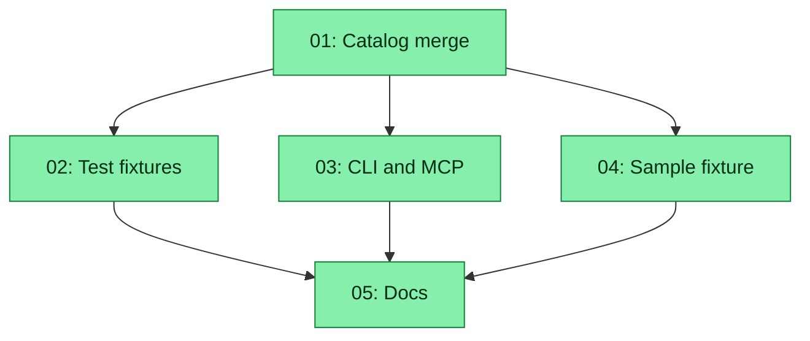

# Spec: Src-Master Plugin Catalog

## Status
Completed

## Overview

The unified-plugin-zips work made **committed `plugins/<id>.zip` the live
catalog**, with `plugins/src/<id>/` as an editable tree that you pack before
the monitor can see it. That is the wrong split for first-party plugins in
this repo: the zips are generated artefacts, they drift across zlib builds,
and the default scanner ignores source until you pack.

This spec flips the catalog:

- **Shipped views** are `plugins/src/<id>/` (git-tracked YAML / TS / Python /
  GLSL). Default `scan()` loads those trees directly.
- **Other people’s plugins** stay a zip. Drop `plugins/<id>.zip` or
  `plugin add` / MCP `install_plugin_zip`. Those zips are a **local contrib
  drop zone**, gitignored, unpacked into `plugins/.runtime/<id>/`.
- **One committed sample zip** lives at `examples/plugins/sample.zip`, packed
  from `examples/plugins/sample/`. It is a contract fixture (every optional
  part present). It is **not** a live view-menu row.
- **npm is out of scope.** No plugin packages, no `plugin add npm:…`, no
  plugin-sdk publish in this spec.

A zip whose `plugin.yml` id already exists under `plugins/src/<id>/` is a
**scan error**: the zip is not loaded, the src row stays. Core plugins cannot
be replaced by a zip.

`plugin pack` still exists so an author can **share** a zip. It must not
write into the live drop zone (that would immediately collide with src).
Default output is gitignored `dist/<id>.zip`; `-o` overrides.

## Key Decisions

- **Src is the shipped catalog.** Default `scan()` reads `plugins/src/<id>/`
  first. No first-party zip is committed under `plugins/`.
- **Zip is the contrib / install format.** `plugins/*.zip` is gitignored.
  MCP and `plugin add` still write there. They never git-commit.
- **Src wins; collision is loud.** If `plugins/src/<id>/` exists, a
  `plugins/<id>.zip` (or a zip whose `plugin.yml` id is `<id>`) is recorded
  on `scan()["errors"]` and skipped. `plugin add` / MCP refuse the write
  even with `--force` / `force: true`.
- **Sample is a fixture, not a view.** `examples/plugins/sample/` + committed
  `examples/plugins/sample.zip`. Demonstrates every optional zip part. Not
  copied into `plugins/src/`. Default scan does not walk `examples/`.
- **Pack is for sharing, not for going live.** `plugin pack <id> [-o path]`
  default `dist/<id>.zip`. First-party edits are live from src without packing.
- **npm is not a distribution channel** for plugins in this spec.
- **Delete the untracked core zips and the `cpu-pong` src duplicate** (id
  `cpupong` collides with `plugins/src/cpupong/`) as part of the scanner
  change so default scan is not a wall of errors.
- **`scan(root)` merges whenever src is present**, not only when `root is
  None`. A directory with neither src trees nor zips still falls back to
  YAML/tree scan.

## Requirements

1. Default monitor / `GET /api/plugins` / `plugin list` catalog is the union
   of `plugins/src/<id>/` trees and non-colliding `plugins/*.zip`.
2. `.gitignore` ignores `plugins/*.zip` and `dist/`. It does not ignore
   `plugins/src/**` or `examples/plugins/**`.
3. Catalog tests no longer require a committed zip per src id. Pack
   byte-identity is asserted only for `examples/plugins/sample.zip`.
4. `plugin add` and MCP `install_plugin_zip` refuse any id that already has
   a src tree (hard refuse, not overridable by force).
5. Home-dir migration copies into `plugins/src/<id>/` and treats that as
   live; it must not tell the operator to pack in order to commit a zip.
6. Docs describe src-as-catalog and zip-as-contrib. The zip contract
   fragment stays; it is the interchange format, not the shipped catalog.
7. One all-features sample fixture under `examples/plugins/sample/`.
8. No npm publish, registry, or install path is introduced.

## Rollback

If the merge lands a `scan()` bug that hides the view menu, revert the
`scan()` / `_scan_catalog()` change in `service/plugins.py` and restore the
previous zip-only `_scan_roots(None)` path. Un-ignore `plugins/*.zip` in
`.gitignore` only if you need the old committed-zip catalog again; regenerate
those zips with `plugin pack` (or `pack_tree`) for every `plugins/src/<id>/`.
Src trees are not deleted by this spec and remain the recovery source.

## Subtask Manifest

Every subtask is listed here with its file, assigned agent, dependencies, and phase.
Subtask IDs are numbered in dependency order — lower IDs never depend on higher IDs.

| ID | File | Subagent | Dependencies | Phase | Status |
|----|------|----------|-------------|-------|--------|
| 01 | `subtask-01-src-master-plugin-catalog-catalog-merge-20260916.md` | generalPurpose | — | 1 | Done |
| 02 | `subtask-02-src-master-plugin-catalog-test-fixtures-20260916.md` | generalPurpose | 01 | 2 | Done |
| 03 | `subtask-03-src-master-plugin-catalog-cli-mcp-pack-20260916.md` | generalPurpose | 01 | 2 | Done |
| 04 | `subtask-04-src-master-plugin-catalog-sample-fixture-20260916.md` | generalPurpose | 01 | 2 | Done |
| 05 | `subtask-05-src-master-plugin-catalog-docs-20260916.md` | generalPurpose | 02, 03, 04 | 3 | Done |

## Subtask Dependency Graph

## Execution Order

Phases are derived from the dependency graph. Subtasks within a phase have no
dependencies on each other and may run in parallel. A phase starts only after
all subtasks in prior phases are complete.

### Phase 1 (Parallel)
| ID | Subagent | Description |
|----|----------|-------------|
| 01 | generalPurpose | Default scan merges src + non-colliding zips (including `scan(explicit_root)`); gitignore `plugins/*.zip`; rewrite catalog + paths tests; delete untracked core zips and `plugins/src/cpu-pong/`. |

### Phase 2 (after Phase 1)
| ID | Subagent | Description |
|----|----------|-------------|
| 02 | generalPurpose | Split remaining src+zip test fixtures (frontend, sky, backend, plugins) so they do not collide under the merge. |
| 03 | generalPurpose | `plugin pack -o` / default `dist/<id>.zip`; add + MCP hard-refuse src ids; retarget dirty-tree and migrate hints. |
| 04 | generalPurpose | Author `examples/plugins/sample/` with every optional part; commit packed `examples/plugins/sample.zip`; pack-reproducible test for that zip only. |

### Phase 3 (after Phase 2)
| ID | Subagent | Description |
|----|----------|-------------|
| 05 | generalPurpose | Rewrite plugins / contributing / api / install / agent / plugins-ts / README / zip-contract wording; run the full pytest + vitest suites. |

## Definition of Done

- [x] Default `plugins.scan()` lists every `plugins/src/<id>/` view without
      any `plugins/<id>.zip` on disk.
- [x] A colliding `plugins/<id>.zip` is an error and is not loaded.
- [x] `plugins/*.zip` and `dist/` are gitignored; `examples/plugins/sample.zip`
      is tracked.
- [x] `plugin add` / MCP cannot replace a src id (even with force).
- [x] `plugin pack` writes `dist/<id>.zip` by default (or `-o`), not the live
      drop zone.
- [x] Sample fixture contains visualisation, frontend, backend, datasource,
      and sky parts and is absent from the live menu.
- [x] Docs no longer tell contributors to `git add plugins/<id>.zip`.
- [x] npm is not mentioned as a plugin install path.
- [x] Targeted tests for 01–04 pass; 05 leaves pytest + vitest green.
- [x] No linter errors in modified files.

## Execution Notes

Completed 2026-09-16 after parent approve_completion. Started 2026-09-16 00:38:46 UTC; report 2026-09-16 04:02:57 UTC (3h 24m 11s). All five subtasks Verified (01 after one fix-list respawn for `plugins/src/cpu-pong/`). Pytest 279 + vitest 176 passed; onStop exit 0. Report: `execution-report-src-master-plugin-catalog-20260916.md`. `examples/plugins/sample.zip` is on disk and not committed.

Judge assessment 2026-09-16: Approve 4.1/5. Spec-file fixes from that
assessment were applied (split former 01, rollback paragraph, explicit
`scan(root)` merge, stale `.runtime` note, sample-only byte-identity
intent, zip-deletion ordering).
